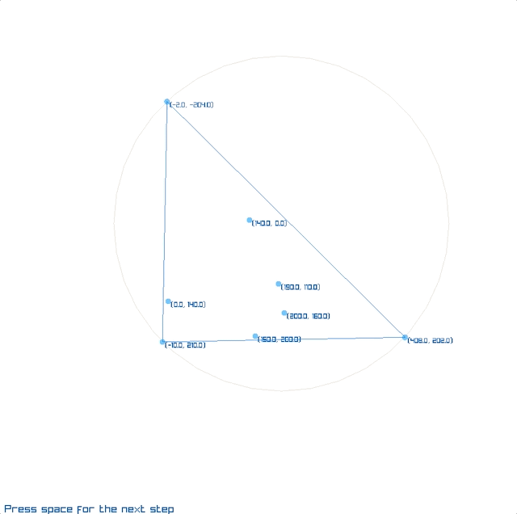

# Delaunay triangulation in Go

This is implementation of the [Bowyer–Watson algorithm](https://en.wikipedia.org/wiki/Bowyer%E2%80%93Watson_algorithm) for the Delaunay triangulation as 
described by [Paul Bourke](http://paulbourke.net/papers/triangulate/). It is not optimized neither for speed nor for space.

Use at our own risk.

Usage:

```
    import d "github.com/uaraven/delaunay/delaunay"

    points := []d.Point{....}
    delaunay := d.InitDelaunay(points)
    triangles := delaunay.Triangulate()
```


Included is `delaunay_visual.go` to view the process of triangulation step by step.
